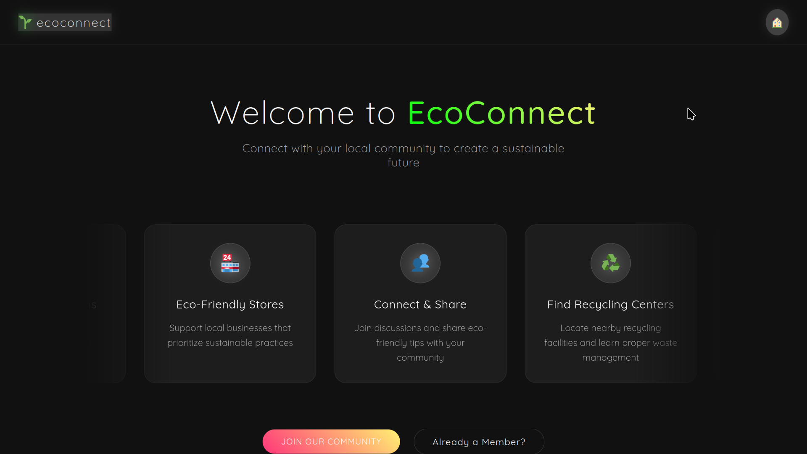
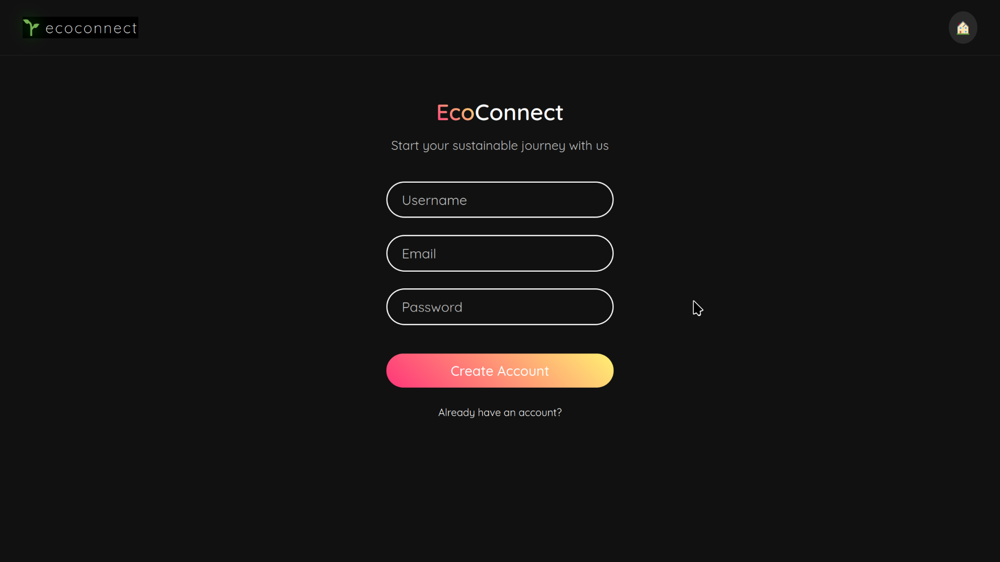
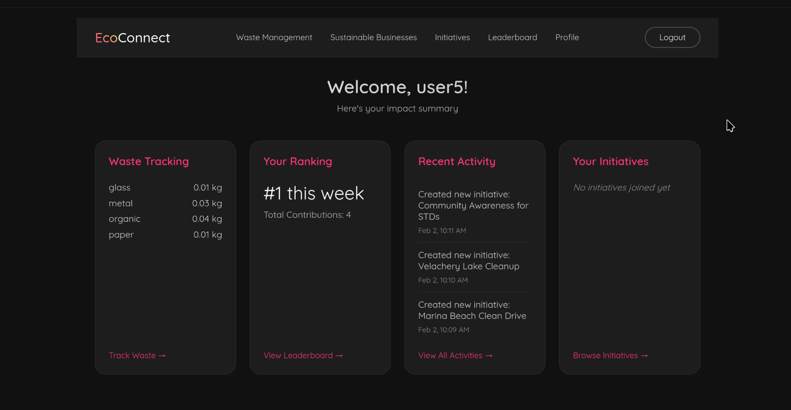
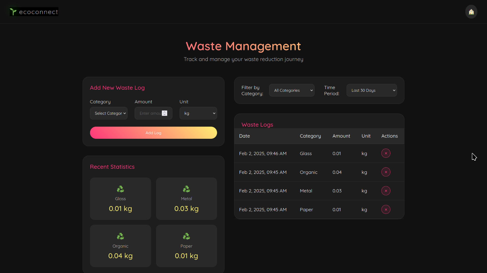
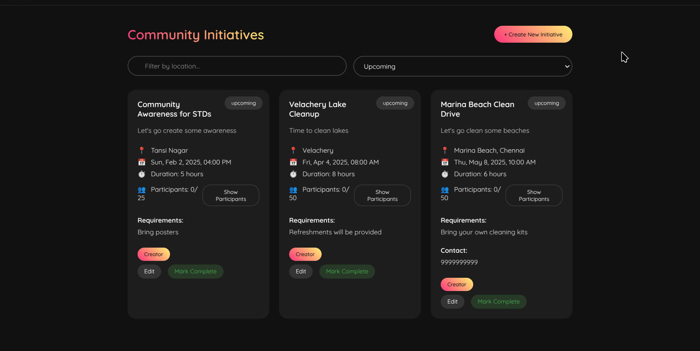
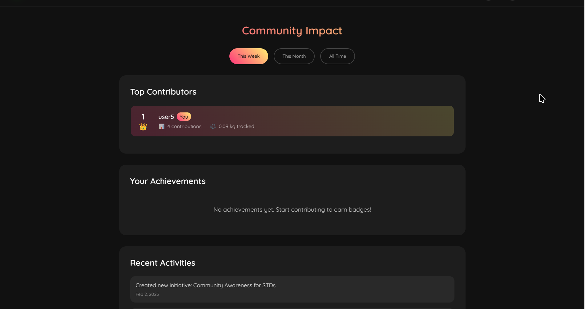
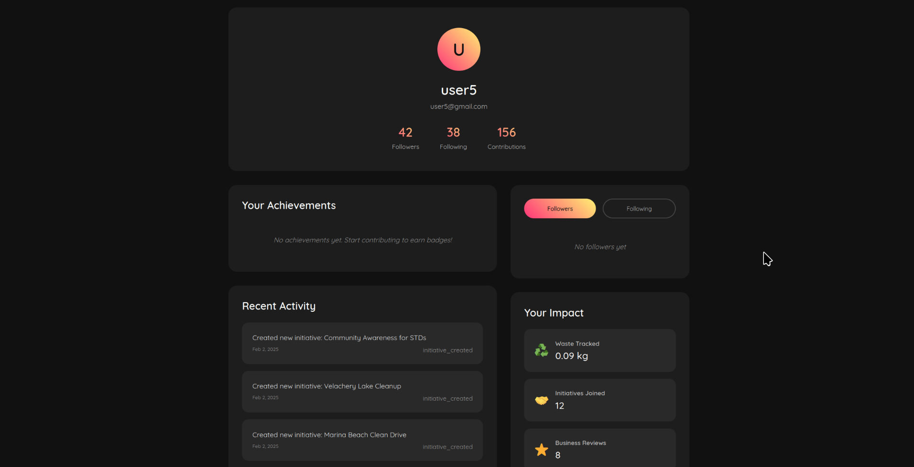

# EcoConnect

EcoConnect is a comprehensive platform that brings together eco-conscious individuals and businesses to track waste management, discover sustainable businesses, and participate in environmental initiatives. The platform features waste tracking, an eco-friendly business directory, social networking, and community initiatives.

---

### 1. **Home Page**
The **Home Page** provides an overview of EcoConnect's mission and features. It includes a call-to-action for users to join the platform, along with highlights of recent community initiatives and top-performing eco-friendly businesses.

  


---

### 2. **Authentication**
  
The **Authentication** page allows users to securely log in or sign up. It supports email/password authentication as well as social login options for convenience.

---

### 3. **User Dashboard**
  
The **User Dashboard** is the central hub for users to track their environmental impact. It displays personalized statistics, recent waste logs, and progress toward sustainability goals.

---

### 4. **Waste Tracking**
  
The **Waste Tracking** feature enables users to log and monitor their waste production. Users can categorize waste, view detailed statistics, and filter logs by date range or waste type.

---

### 5. **Community Initiatives**
  
The **Community Initiatives** section allows users to discover, join, and create environmental projects. Initiatives are filterable by location, status, and type, making it easy to find relevant opportunities.

---

### 6. **Leaderboard**
  
The **Leaderboard** showcases top-performing users and businesses based on their environmental contributions. It includes weekly, monthly, and all-time rankings to encourage friendly competition.

---

### 7. **User Profile**
  
The **User Profile** page displays a user's achievements, badges, and activity history. It also allows users to manage their settings and connect with others in the community.

---

## Features

- **Waste Tracking System**
  - Log and monitor waste production
  - Track different waste categories
  - View statistics and progress
  - Filter logs by category and date range

- **Eco-Friendly Business Directory**
  - Browse verified sustainable businesses
  - Review and rating system
  - Search and filter functionality
  - Business verification system

- **Social Features**
  - Follow other environmentally conscious users
  - Activity feed showing community actions
  - Achievement system with badges
  - Weekly/monthly/all-time leaderboards

- **Community Initiatives**
  - Create and join environmental initiatives
  - Track participation and progress
  - Filter initiatives by location and status
  - Social sharing capabilities

## Getting Started

### Prerequisites

- Python 3.8 or higher
- Node.js 14 or higher
- npm 6 or higher
- Virtual environment tool (e.g., venv)

### Installation

1. Clone the repository:
```bash
git clone https://github.com/azeebneuron/DumbAsurs-Hacksprint.git
cd DumbAsurs-Hacksprint
```

2. Set up the backend:
```bash
# Create and activate virtual environment
python -m venv venv
source venv/bin/activate  # On Windows, use: venv\Scripts\activate

# Install backend dependencies
pip install -r requirements.txt

# Start the backend server
python run.py
```

3. Set up the frontend:
```bash
# Navigate to frontend directory
cd ecoconnect-frontend

# Install frontend dependencies
npm install

# Start the frontend development server
npm run serve
```

The application will be available at:
- Frontend: http://localhost:8080
- Backend API: http://localhost:5050

### Testing

Test the API endpoints using the provided curl commands in the [API Documentation](docs/API.md).

## Contributing

1. Fork the repository
2. Create your feature branch (`git checkout -b feature/AmazingFeature`)
3. Commit your changes (`git commit -m 'Add some AmazingFeature'`)
4. Push to the branch (`git push origin feature/AmazingFeature`)
5. Open a Pull Request

## Acknowledgments

- Thanks to my amazing teammates: [ashutosh-utsav](https://github.com/ashutosh-utsav), [sarthaksinghgaur](https://github.com/sarthaksinghgaur), [sambhav226](https://github.com/sambhav226)
- Special thanks to the Hacksprint organizers
- Inspired by the need for better waste management and environmental awareness tools

## Video Demo
Watch our platform demonstration here: [EcoConnect Demo Video](https://drive.google.com/file/d/1u77OWWh0wKOiZDfFQjjTvO2u4j-obxvC/view?usp=sharing)
